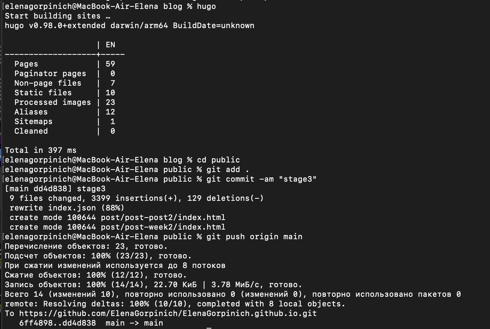
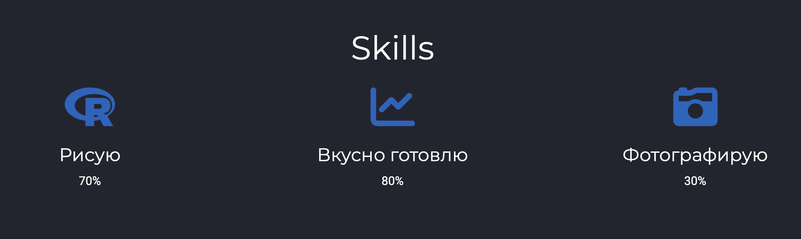
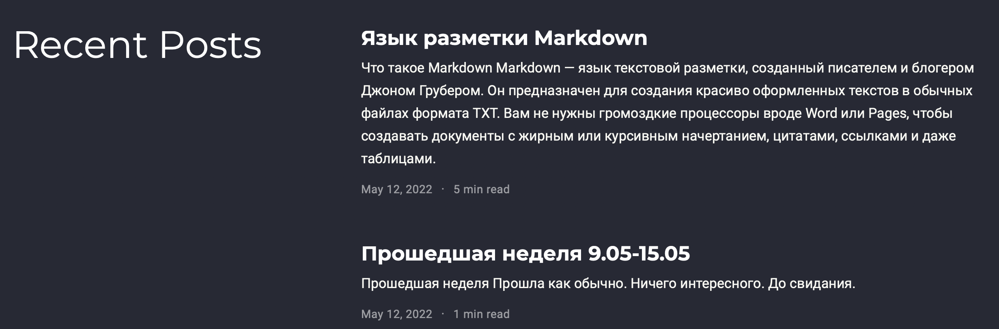

# Отчёт по третьему этапу индивидуального проекта
## Дисциплина: Операционные системы
Горпинич Елена Михайловна

---

# Цель работы

Добавить к сайту свои достижения и два поста (по прошедшей неделе и по теме: "Язык разметки Markdown")

---

# Выполнение этапа №3

## Примеры описанные в первой части лабораторной работы
1)  Заходим /Users/elenagorpinich/work/blog/content/home и открываем три файла в которых мы поменяем данные на свои (skills, experiens, accomplishments)

---
2)  Cоздаём два файла для наших постов. Пишем команду hugo new post/ [имя файла].md. Она создает файл в формате Markdown, в который мы добавляем наш пост. (рис.[4.1])

---
/
/

3)  Запускаем hugo, заходим в каталог public, добавили файлы. Обновляем https://elenagorpinich.github.io/ и можем увидеть свои обновленные данные 

---

4) Зайдём на наш сайт и проверим изменения. (рис.[5-7])

---

---

---

# Вывод

Добавили к сайту свои достижения и два поста (по прошедшей неделе и по теме: "Язык разметки Markdown")

