---
## Front matter
title: "Отчёт по первому этапу индивидуального проекта"
subtitle: "Дисциплина: Операционные системы"
author: "Горпинич Елена Михайловна"

## Generic otions
lang: ru-RU
toc-title: "Содержание"

## Bibliography
bibliography: bib/cite.bib
csl: pandoc/csl/gost-r-7-0-5-2008-numeric.csl

## Pdf output format
toc: true # Table of contents
toc-depth: 2
lof: true # List of figures
lot: true # List of tables
fontsize: 12pt
linestretch: 1.5
papersize: a4
documentclass: scrreprt
## I18n polyglossia
polyglossia-lang:
  name: russian
  options:
	- spelling=modern
	- babelshorthands=true
polyglossia-otherlangs:
  name: english
## I18n babel
babel-lang: russian
babel-otherlangs: english
## Fonts
mainfont: PT Serif
romanfont: PT Serif
sansfont: PT Sans
monofont: PT Mono
mainfontoptions: Ligatures=TeX
romanfontoptions: Ligatures=TeX
sansfontoptions: Ligatures=TeX,Scale=MatchLowercase
monofontoptions: Scale=MatchLowercase,Scale=0.9
## Biblatex
biblatex: true
biblio-style: "gost-numeric"
biblatexoptions:
  - parentracker=true
  - backend=biber
  - hyperref=auto
  - language=auto
  - autolang=other*
  - citestyle=gost-numeric
## Pandoc-crossref LaTeX customization
figureTitle: "Рис."
tableTitle: "Таблица"
listingTitle: "Листинг"
lofTitle: "Список иллюстраций"
lotTitle: "Список таблиц"
lolTitle: "Листинги"
## Misc options
indent: true
header-includes:
  - \usepackage{indentfirst}
  - \usepackage{float} # keep figures where there are in the text
  - \floatplacement{figure}{H} # keep figures where there are in the text
---

# Цель работы

Разместить на Github pages заготовки для персонального сайта.

# Задание

Установить необходимое программное обеспечение.
Скачать шаблон темы сайта.
Разместить его на хостинге git.
Установить параметр для URLs сайта.
Разместить заготовку сайта на Github pages.

# Общая информация 
## Генератор статических сайтов

Для реализации сайта используется генератор статических сайтов Hugo.
Сайт: https://gohugo.io/
Репозиторий: https://github.com/gohugoio/hugo
Генератор статических сайтов Hugo
## Шаблон для сайта

Общие файлы для тем Wowchemy:
Репозиторий: https://github.com/wowchemy/wowchemy-hugo-themes
В качестве шаблона индивидуального сайта используется шаблон Hugo Academic Theme.
Демо-сайт: https://academic-demo.netlify.app/
Репозиторий: https://github.com/wowchemy/starter-hugo-academic
В качестве шаблона для группового проекта используется шаблон Hugo Research Group Theme.
Демо-сайт: https://research-group.netlify.app/
Репозиторий: https://github.com/wowchemy/starter-hugo-research-group

# Выполнение первого этапа

## Шаг 1 
1)  Скачиваем исполняемый файл hugo(рис.[1])
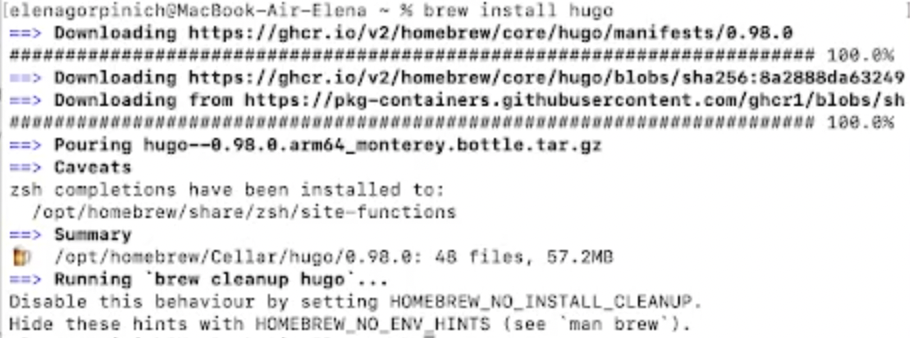
2)  Создаём каталог blog(рис.[2])
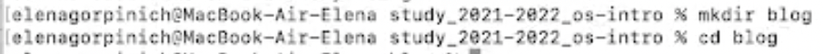
3)  Затем создаем репозиторий и выполняем команду "clone"(рис.[3-6])
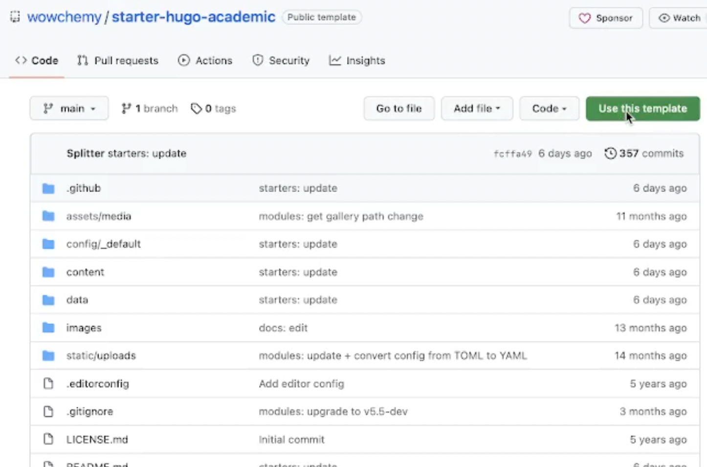
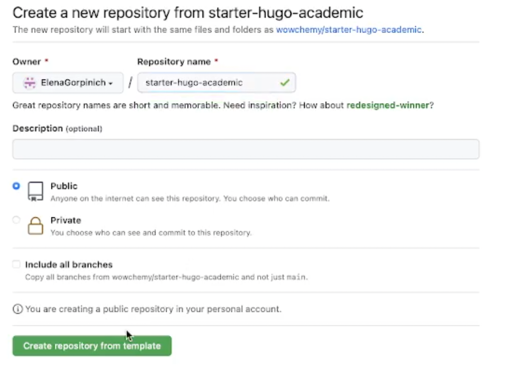
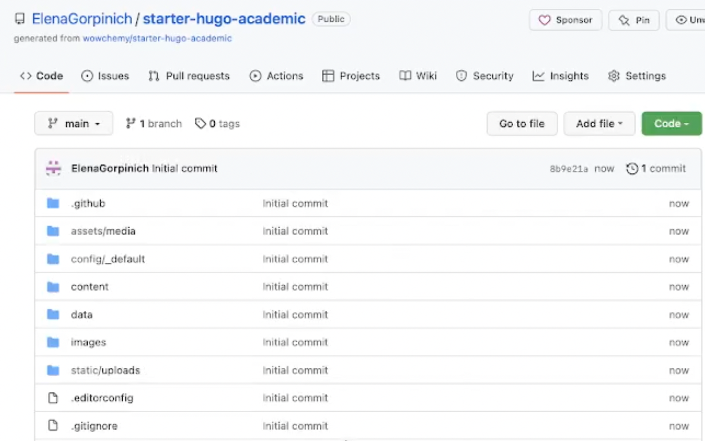
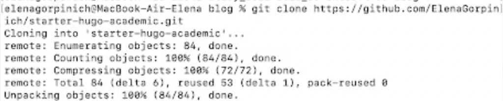
4)	Выполняем команду "hugo server" (рис.[7])
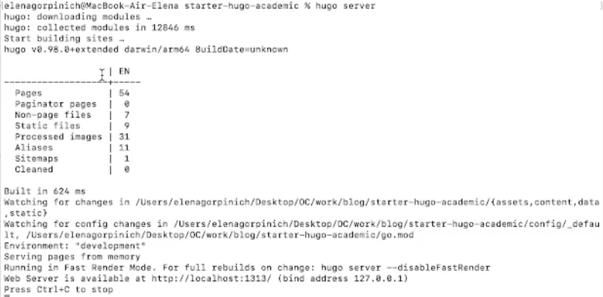 
5)  Копируем и вставляем в браузер ссылку из предпоследней строчки (http://localhost:1313) . В результате мы можем увидеть страницу на сайте "Academic", фон страницы зеленый (рис.[8]), чтобы это изменить открываем каталог blog, затем content, далее home и удаляем файл "demo.md"(рис.[9])
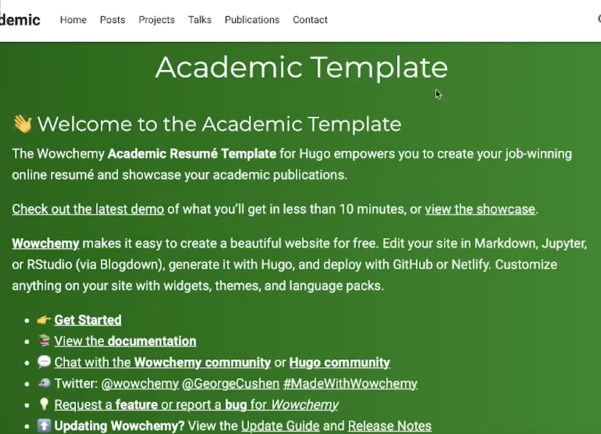
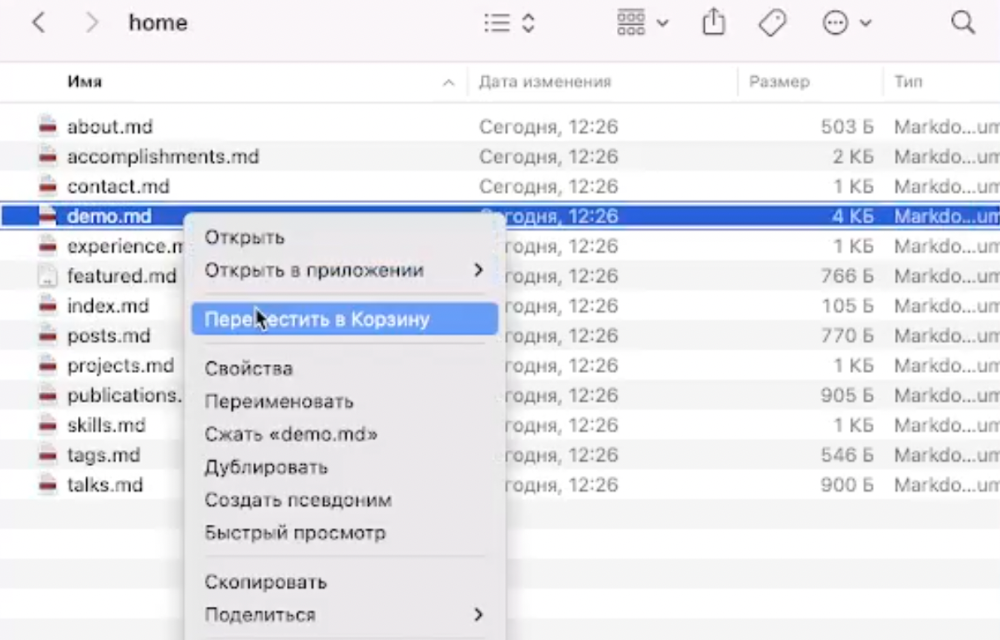
6)	Обновляем страницу в браузере и теперь зеленый фон стал белый. Завершаем hugo server
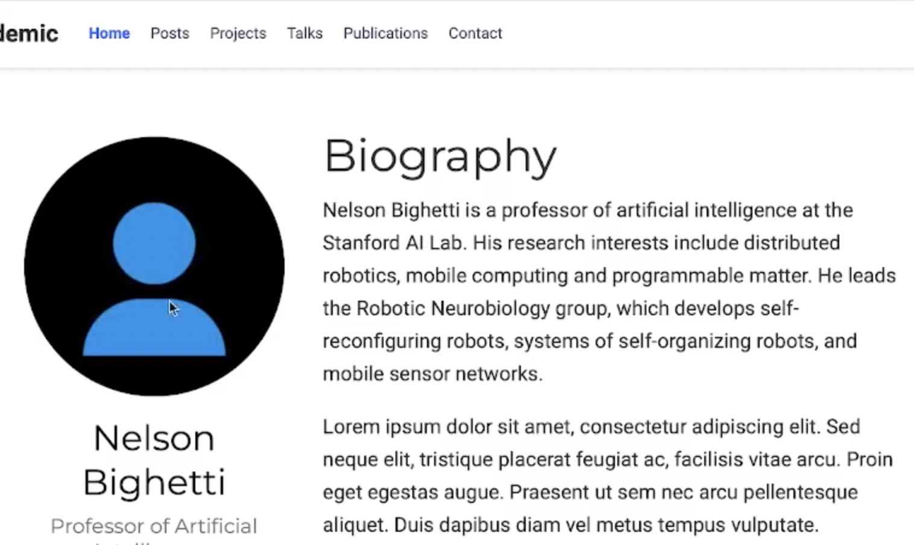
## Шаг 2(Перенос сайта на новый репозиторий)
1)	Создадим новый репозиторий под названием ElenaGorpinich.github.io/ (рис.[11-12])
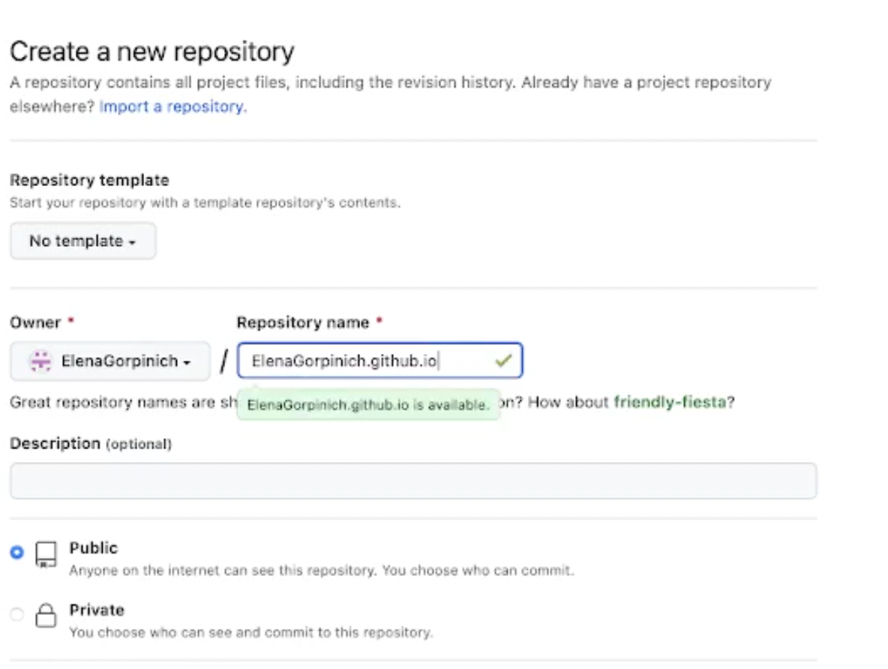
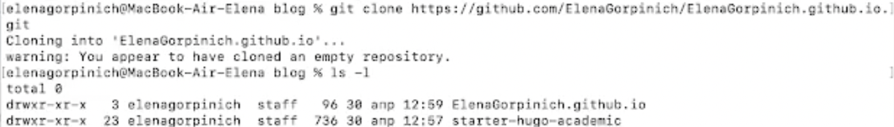
2)	Создаём ветку main и пустой файл "README.md", который перемещаем в наш репозиторий(рис.[13])
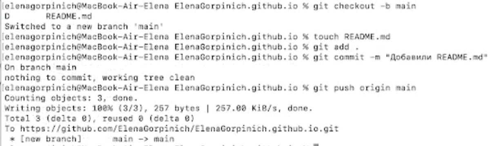
3) Чтобы эффективно генерировать страницы сайта выполняем следующую команду:
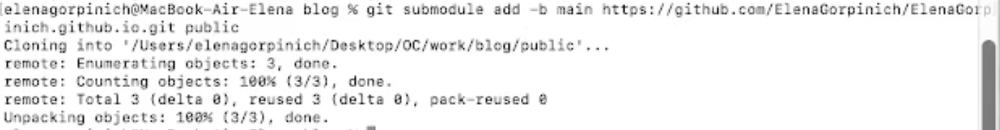
4) Используем каталог public и проверяем подключен ли каталог к нашему репозиторию.(рис.[15])
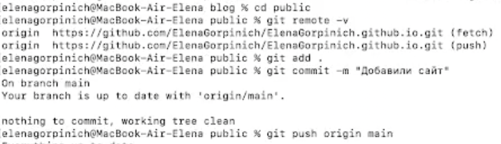
5) Обновляем репозиторий и проверяем наличие фалов (рис.[16])
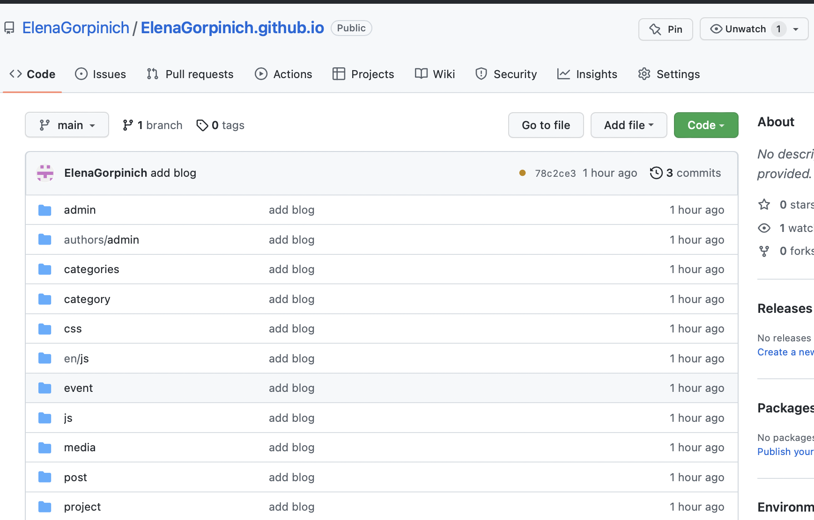
6) Копируем ссылку на наш новый сайт, вставляем в браузер и немного ждем (рис.[17-18])
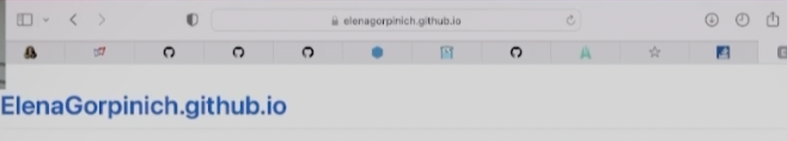

# Вывод

В ходе данного этапа мне удалось выполнить поставленные задачи, а именно:
- Установить необходимое программное обеспечение.
- Скачать шаблон темы сайта.
- Разместить его на хостинге git.
- Установить параметр для URLs сайта.
- Разместить заготовку сайта на Github pages.

