# Отчёт по лабораторной работе №10
## Дисциплина: Операционные системы
Горпинич Елена Михайловна

---
# Цель работы

Изучить основы программирования в обо- лочке ОС UNIX/Linux. Научиться писать небольшие командные файлы.

---

# Выполнение лабораторной работы

1)  С помощью команды «man», изучим команды архивации(рис.[1-4]).
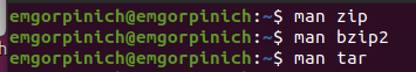

---

2) Создала файл, в котором буду писать первый скрипт, и открыла его в редакторе emacs, используя клавиши «Ctrl-x»и «Ctrl-f» (команды «touch backup.sh» и «emacs &»).(рис.[5])
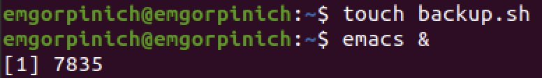

---

3)	Написала скрипт, который при запуске будет делать резервную копию самого себя в другую директорию back up в вашем домашнем каталоге. При этом файл должен архивироваться одним из архиваторов на выбор zip, bzip2 или tar . При написании скрипта использовала архиватор bzip2.
(рис.[6])
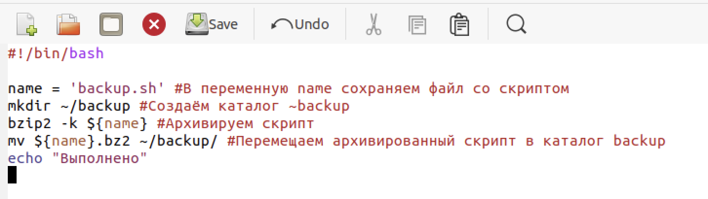

---

4)  Проверила работу скрипта (команда «./backup.sh»), предварительно добавив для него право на выполнение (команда «chmod +x *.sh»). Проверила, появился ли каталог backup/, перейдя в него, посмотрела его содержимое и просмотрела содержимое архива (команда «bunzip2 -cbackup.sh.bz2»). Скрипт работает корректно. (рис.[7-8])

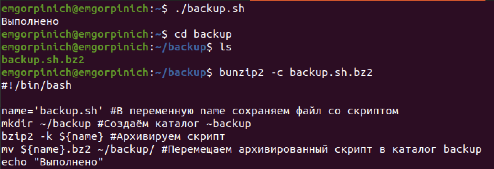

---
5)	 Создала файл, в котором буду писать второй скрипт, и открыла его в редакторе emacs, используя те же команды что и на 2 шаге(рис.[9])
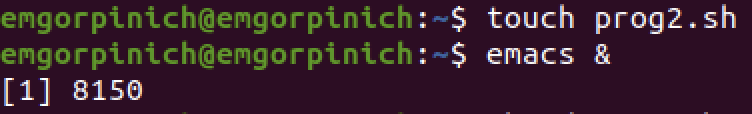	

---
6) Написала пример командного файла, обрабатывающего любое произвольное число аргументов командной строки, в том числе превышающее десять. (рис.[10])
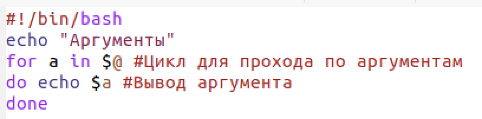

---
7) Проверила работу написанного скрипта (команды «./prog2.sh0 1 2 3 4» и «./prog2.sh0 1 2 3 45 6 7 8 9 10 11»), предварительно добавив для него право на выполнение (команда «chmod+x*.sh»). Вводила аргументы количество которых меньше 10 и больше 10. Скрипт работает корректно.(рис.[11-12])
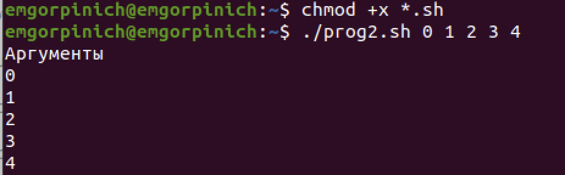

---
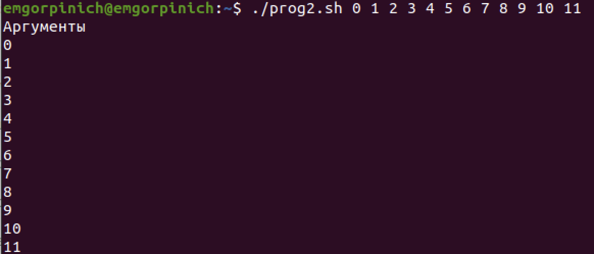

---
8) Создала файл, в котором буду писать третий скрипт(шаг 2))(рис.[13])
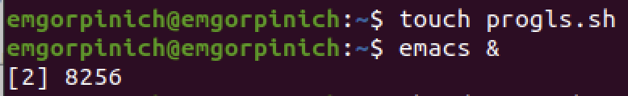

---
9) Написала командный файл − аналог команды ls. Он должен выдавать информацию о нужном каталоге и выводить информацию о возможностях доступа к файлам этого каталога (рис.[14])

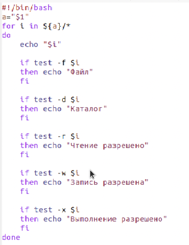

---
10) Далее проверила работу скрипта (команда «./progls.sh~»), предварительно добавив для него право на выполнение. Скрипт работает корректно.
 (рис.[15])
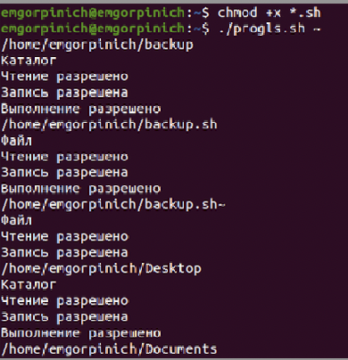

---
11) Создадим файл для четвёртого скрипта(рис.[16])
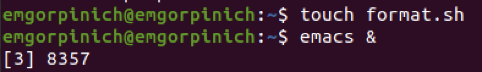

---
12) Написала командный файл, который получает в качестве аргумента командной строки формат файла  и вычисляет количество таких файлов в указанной директории. Путь к директории также передаётся в виде аргумента командной строки  (рис.[17])
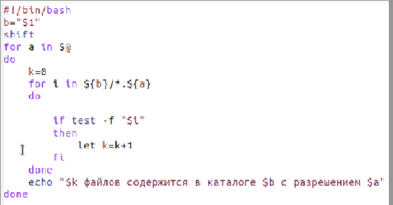

---

16) Проверила работу написанного скрипта (команда «./format.sh~ pdf sh txt doc»), предварительно добавив для него право на выполнение.Скрипт работает корректно (рис.[18])
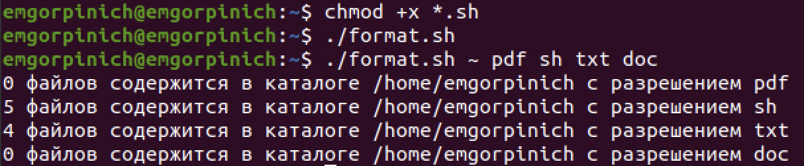

---
# Вывод

В ходе выполнения данной лабораторной работы я познакомилась с операционной системой Linux и получила практические навыки работы с редактором Emacs.
