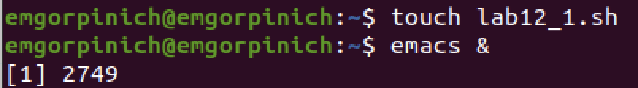
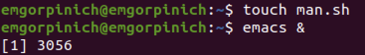

# "Отчёт по лабораторной работе №12"
## "Дисциплина: Операционные системы"
"Горпинич Елена Михайловна"

---
# Цель работы

Изучить основы программирования в оболочке ОС UNIX. Научиться писать более сложные командные файлы с использованием логических управляющих конструкций и циклов.

---
# Выполнение лабораторной работы

1)  Написала командный файл, реализующий упрощённый механизм семафоров. Командный файл должен в течение некоторого времени t1 дожидаться освобождения ресурса, выдавая об этом сообщение, а дождавшись его освобождения, использовать его в течение некоторого времени t2<>t1, также выдавая информацию о том, что ресурс используется соответствующим командным файлом (процессом). Для данной задачи я создала файл и написала соответствующий скрипт.

---

---
Далее я проверила работу написанного скрипта, предварительно добавив право на исполнение файла. Скрипт работает корректно.

---
После этого я изменила скрипт так, чтобы его можно было выполнять в нескольких терминалах и проверила его работу

---

---

---
/
/
/
/
/
/
/
/
/

2) Реализовала команду man с помощью командного файла. Изучила содержимое каталога /usr/share/man/man1. В нем находятся архивы текстовых файлов, содержащих справку по большинству установленных в системе программ и команд. Каждый архив можно открыть командой less сразу же просмотрев содержимое справки. Командный файл должен получать в виде аргумента командной строки название команды и в виде результата выдавать справку об этой команде или сообщение об отсутствии справки, если соответствующего файла нет в каталоге man1

---
Для данной задачи я создала файл и написала соответствующий скрипт 

	

---
Далее я проверила работу написанного скрипта , предварительно добавив право на исполнение файла. Скрипт работает корректно.

---

---
3)	Используя встроенную переменную $RANDOM, написала командный файл, генерирующий случайную последовательность букв латинского алфавита. Для данной задачи я создала файл: random.sh и написала соответствующий скрипт 

---
Далее я проверила работу написанного скрипта, предварительно добавив право на исполнение файла. Скрипт работает корректно.

 

---
# Вывод

В ходе выполнения данной лабораторной работы я изучила основы программирования в оболочке ОС UNIX и научилась писать более сложные командные файлы с использованием логических управляющих конструкций и циклов.
