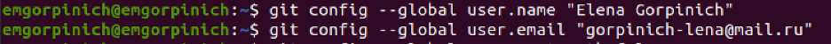
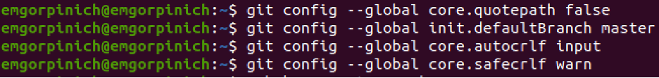
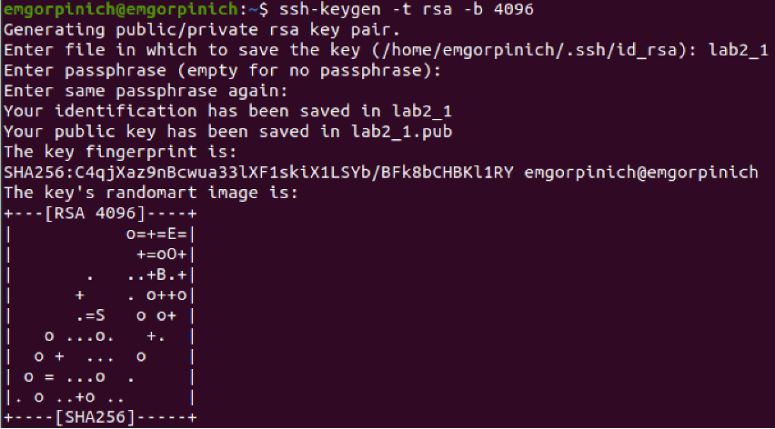
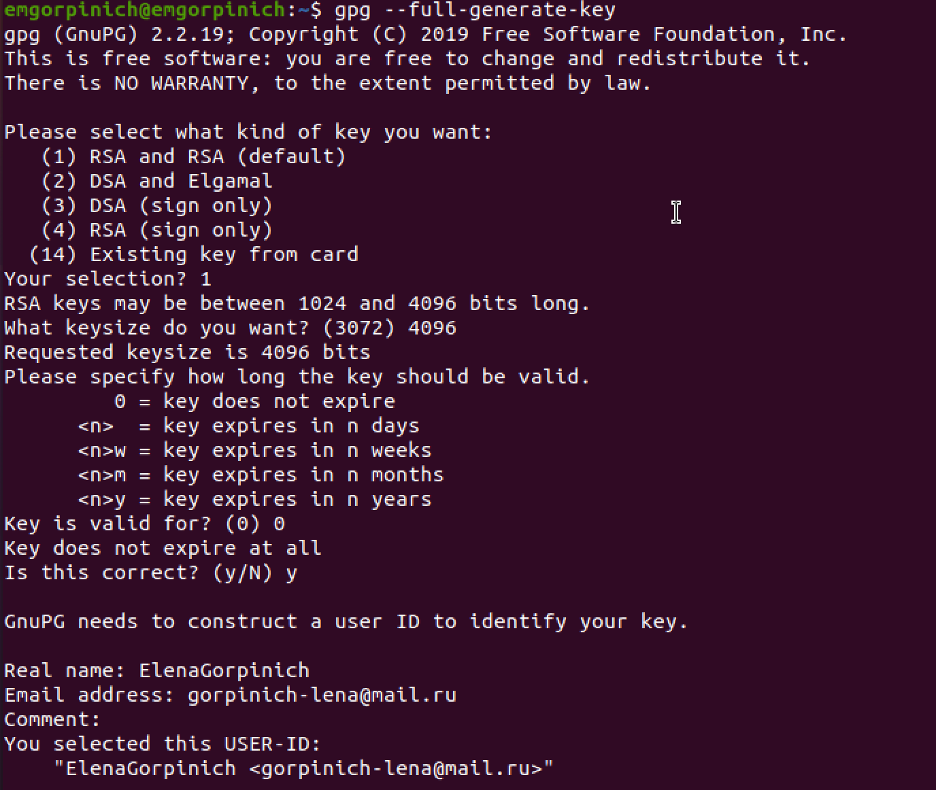
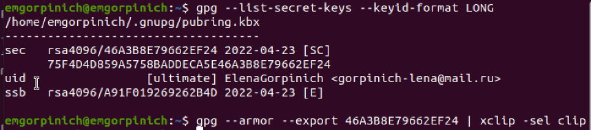
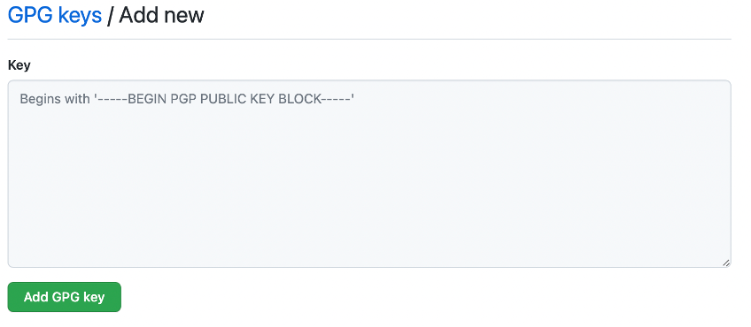
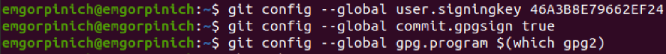
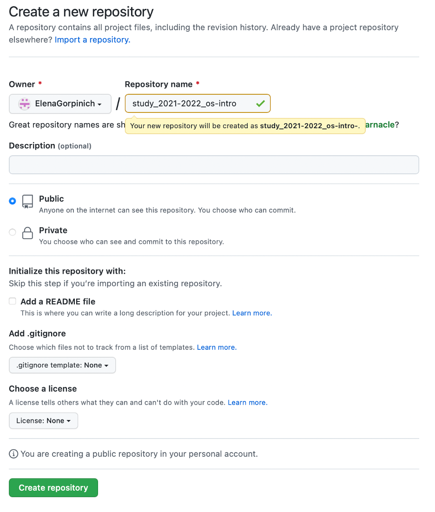
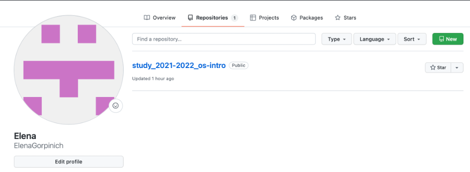

---
## Front matter
title: "Отчёт по лабораторной работе"
subtitle: "Дисциплина: Операционные системы"
author: "Елена Михайловна Горпинич"

## Generic otions
lang: ru-RU
toc-title: "Содержание"

## Bibliography
bibliography: bib/cite.bib
csl: pandoc/csl/gost-r-7-0-5-2008-numeric.csl

## Pdf output format
toc: true # Table of contents
toc-depth: 2
lof: true # List of figures
lot: true # List of tables
fontsize: 12pt
linestretch: 1.5
papersize: a4
documentclass: scrreprt
## I18n polyglossia
polyglossia-lang:
  name: russian
  options:
	- spelling=modern
	- babelshorthands=true
polyglossia-otherlangs:
  name: english
## I18n babel
babel-lang: russian
babel-otherlangs: english
## Fonts
mainfont: PT Serif
romanfont: PT Serif
sansfont: PT Sans
monofont: PT Mono
mainfontoptions: Ligatures=TeX
romanfontoptions: Ligatures=TeX
sansfontoptions: Ligatures=TeX,Scale=MatchLowercase
monofontoptions: Scale=MatchLowercase,Scale=0.9
## Biblatex
biblatex: true
biblio-style: "gost-numeric"
biblatexoptions:
  - parentracker=true
  - backend=biber
  - hyperref=auto
  - language=auto
  - autolang=other*
  - citestyle=gost-numeric
## Pandoc-crossref LaTeX customization
figureTitle: "Рис."
tableTitle: "Таблица"
listingTitle: "Листинг"
lofTitle: "Список иллюстраций"
lotTitle: "Список таблиц"
lolTitle: "Листинги"
## Misc options
indent: true
header-includes:
  - \usepackage{indentfirst}
  - \usepackage{float} # keep figures where there are in the text
  - \floatplacement{figure}{H} # keep figures where there are in the text
---

# Цель работы

Изучить идеологию и применение средств контроля версий и освоить умения по работе с git. 

# Задание

Создать базовую конфигурацию для работы с git
Создать ключ SSH
Создать ключ PGP
Настроить подписи git
Зарегистрироваться на GitHub
Создать локальный каталог для выполнения заданий по предмету 

# Теоретическое введение

Система контроля версий Git представляет собой набор программ командной строки. Доступ к ним можно получить из терминала посредством ввода команды git с различными опциями. Благодаря тому, что Git является рапределённой системой контроля версий, резервную копию локального хранилища можно сделать простым копированием или архивацией. 
## Основные команды git 
git add
Команда добавляет содержимое рабочего каталога в индекс  для последующего коммита.
git status
Команда git status показывает состояния файлов в рабочем каталоге и индексе
git diff
Команда git diff используется для вычисления разницы между любыми двумя Git деревьями. 

git difftool
Команда git difftool просто запускает внешнюю утилиту сравнения для показа различий в двух деревьях, на случай если вы хотите использовать что-либо отличное от встроенного просмотрщика git diff.

git commit
Команда git commit берёт все данные, добавленные в индекс с помощью git add, и сохраняет их слепок во внутренней базе данных, а затем сдвигает указатель текущей ветки на этот слепок.

git reset
Команда используется в основном для отмены изменений. 

git rm
Команда git rm используется в Git для удаления файлов из индекса и рабочей копии. 

git mv
Команда git mv — это всего лишь удобный способ переместить файл, а затем выполнить git add для нового файла и git rm для старого.

git clean
Команда git clean используется для удаления мусора из рабочего каталога. 

# Выполнение лабораторной работы

## Настройка GitHub
1)  Изначально создаём учетную запись и заполняем основные данные на официальном сайте. https://github.com.(рис.[1])

2)  Затем синхронизируем учетную запись с компьютером с помощью терминала. (рис.[2])

3)  Начинаем базовую настройку git: настроим utf-8 в выводе сообщений git, верификацию и подписание коммитов git, зададим имя начальной̆ ветки (будем называть её master), параметр autocrlf, параметр safecrlf (рис.[3])

4)	Создадим ключ ssh по алгоритму rsa с ключевым размером 4096 бит(рис.[4])
 
5)  Создадим ключ pgp. Генерируем ключ и из предложенных опций выбираем опции описанные в условии лабораторной работы. (рис.[5])

6)	Добавим PGP ключ в GitHub. Для этого выводим список ключей и скопируем отпечаток приватного ключа. Скопируем наш сгенерированный PGP ключ в буфер обмена. С помощью настроек GitHub (https://github.com/settings/keys),  добавим наш скопированный ключ, вставив его в поле ввода, которое появилось после нажатия кнопки New GPG key (рис.[7-9])

 

7)	Настроим автоматических подписей коммитов git (рис.[10])

8)	Создадим новый репозиторий курса на основе шаблона и далее настроим каталог курса, удалив ненужные файлы, создав необходимые каталоги и отправив файлы на сервер (рис.[11-12])

 
# Вывод

В данной лабораторной работе я научилась работать с Github (создавать и привязывать учетную запись к компьютеру). Разобрала основные команды git и рассмотрела, как их применять их при работе с Github. Изучила идеологию и научилась применять средства контроля версий

# Список литературы{.unnumbered}

::: {#refs}
:::
